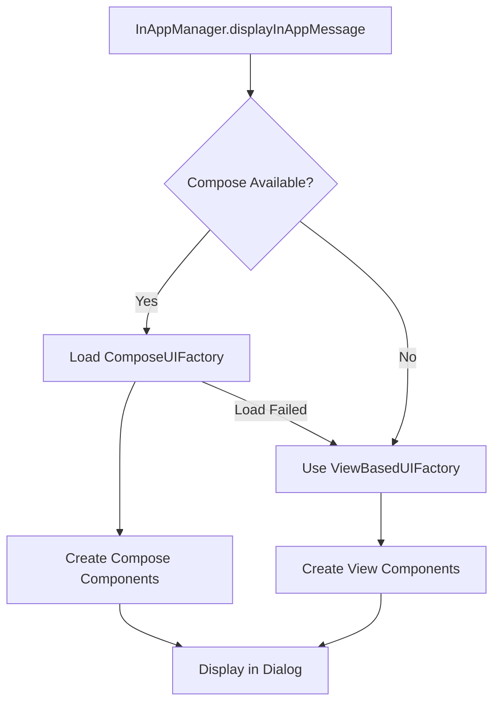

# Revised Compose Architecture Recommendation

## Critical Discovery: Internal UI Control

After analyzing [`InAppManager.java`](android-sdk/src/main/java/com/blueshift/inappmessage/InAppManager.java), I discovered that the SDK internally controls in-app message display through methods like:

- `buildAndShowHtmlInAppMessage()` (line 764)
- `buildAndShowCenterPopupInAppMessage()` (line 720) 
- `buildAndShowSlidingBannerInAppMessage()` (line 786)
- `buildAndShowRatingInAppMessage()` (line 742)

This means the **core SDK must be able to instantiate Compose UI components directly**, making the separate extension SDK approach problematic due to circular dependencies.

## Revised Recommendation: Option 4 - Conditional Compose Loading with Reflection

Given the internal UI control requirement, **Option 4 (Conditional Compose Loading with Reflection)** becomes the optimal solution.

### Why Option 4 is Now Optimal

1. **Solves Circular Dependency**: Core SDK can conditionally use Compose without hard dependency
2. **Single Artifact**: Maintains simple client integration
3. **Automatic Optimization**: Leverages existing Compose dependencies in client apps
4. **Internal Control**: Allows `InAppManager` to directly instantiate Compose components

## Revised Architecture

### Core Concept: Conditional UI Factory Pattern

```kotlin
// In core SDK
interface InAppUIFactory {
    fun createBannerView(context: Context, message: InAppMessage): View
    fun createModalView(context: Context, message: InAppMessage): View
    fun createRatingView(context: Context, message: InAppMessage): View
    fun createHtmlView(context: Context, message: InAppMessage): View
}

// Traditional View implementation (always available)
class ViewBasedUIFactory : InAppUIFactory {
    override fun createBannerView(context: Context, message: InAppMessage): View {
        return InAppMessageViewBanner(context, message)
    }
    // ... other implementations
}

// Compose implementation (conditionally loaded)
class ComposeUIFactory : InAppUIFactory {
    override fun createBannerView(context: Context, message: InAppMessage): View {
        return ComposeView(context).apply {
            setContent {
                BlueshiftTheme {
                    InAppBanner(message = message)
                }
            }
        }
    }
    // ... other implementations
}
```

### Runtime Factory Selection

```kotlin
object InAppUIFactoryProvider {
    private var factory: InAppUIFactory? = null
    
    fun getFactory(context: Context): InAppUIFactory {
        if (factory == null) {
            factory = if (isComposeAvailable()) {
                createComposeFactory()
            } else {
                ViewBasedUIFactory()
            }
        }
        return factory!!
    }
    
    private fun isComposeAvailable(): Boolean {
        return try {
            Class.forName("androidx.compose.ui.platform.ComposeView")
            Class.forName("androidx.compose.runtime.Composable")
            true
        } catch (e: ClassNotFoundException) {
            false
        }
    }
    
    private fun createComposeFactory(): InAppUIFactory {
        return try {
            val clazz = Class.forName("com.blueshift.compose.ComposeUIFactory")
            clazz.newInstance() as InAppUIFactory
        } catch (e: Exception) {
            BlueshiftLogger.w("Compose classes found but ComposeUIFactory failed to load, falling back to Views")
            ViewBasedUIFactory()
        }
    }
}
```

### Modified InAppManager Integration

```java
// Modified buildAndShowCenterPopupInAppMessage method
private static boolean buildAndShowCenterPopupInAppMessage(Context context, InAppMessage inAppMessage) {
    if (context != null && inAppMessage != null) {
        InAppUIFactory factory = InAppUIFactoryProvider.getFactory(context);
        View inAppView = factory.createModalView(context, inAppMessage);
        
        // Apply existing click/dismiss handlers
        if (inAppView instanceof InAppMessageView) {
            // Traditional View - existing logic
            InAppMessageView messageView = (InAppMessageView) inAppView;
            // ... existing callback setup
        } else {
            // Compose View - set up callbacks through ComposeView
            setupComposeCallbacks(inAppView, inAppMessage);
        }
        
        return displayInAppDialogModal(context, inAppView, inAppMessage);
    }
    return false;
}
```

## Implementation Strategy

### Phase 1: Dependency Management (Week 1-2)

#### 1.1 Gradle Configuration
```gradle
// android-sdk/build.gradle
dependencies {
    // Core dependencies (unchanged)
    implementation 'androidx.core:core-ktx:1.13.0'
    implementation 'androidx.appcompat:appcompat:1.5.1'
    
    // Compose dependencies as compileOnly (not included in final artifact)
    compileOnly platform('androidx.compose:compose-bom:2024.02.02')
    compileOnly 'androidx.compose.ui:ui'
    compileOnly 'androidx.compose.ui:ui-tooling-preview'
    compileOnly 'androidx.compose.foundation:foundation'
    compileOnly 'androidx.compose.runtime:runtime'
    compileOnly 'androidx.compose.material3:material3'
    compileOnly 'androidx.lifecycle:lifecycle-runtime-compose:2.8.6'
    compileOnly 'androidx.activity:activity-compose:1.9.0'
}
```

#### 1.2 Conditional Compilation
```kotlin
// Use @JvmName to avoid conflicts
@file:JvmName("ComposeUtils")

// Only compiled if Compose is available
@Suppress("unused") // Used via reflection
class ComposeUIFactory : InAppUIFactory {
    // Implementation only exists if Compose classes are available
}
```

### Phase 2: UI Factory Implementation (Week 3-6)

#### 2.1 Abstract Factory Pattern
- Create `InAppUIFactory` interface
- Implement `ViewBasedUIFactory` (existing logic)
- Implement `ComposeUIFactory` (new Compose components)
- Create factory provider with reflection-based selection

#### 2.2 Compose Component Development
```kotlin
@Composable
fun InAppBanner(
    message: InAppMessage,
    onAction: (String, JSONObject) -> Unit = { _, _ -> },
    onDismiss: (JSONObject) -> Unit = { _ -> }
) {
    // Compose implementation matching existing banner functionality
}
```

### Phase 3: Integration & Testing (Week 7-10)

#### 3.1 InAppManager Modifications
- Update all `buildAndShow*` methods to use factory pattern
- Maintain backward compatibility with existing View-based logic
- Add Compose-specific callback handling

#### 3.2 Testing Strategy
- **Unit Tests**: Factory selection logic
- **Integration Tests**: Both View and Compose paths
- **Size Tests**: APK size with/without Compose
- **Runtime Tests**: Graceful fallback scenarios

## Expected Outcomes

### Size Impact Analysis
| Client Scenario | APK Size Impact |
|-----------------|-----------------|
| **No Compose Dependencies** | +0MB (uses View components) |
| **Existing Compose App** | +~1-2MB (reuses existing Compose runtime) |
| **New Compose Adoption** | +6.8MB (full Compose stack) |

### Runtime Behavior


## Advantages of This Approach

1. **Zero Size Impact**: Clients without Compose see no size increase
2. **Automatic Optimization**: Existing Compose apps get modern UI automatically
3. **Single Codebase**: No separate SDK to maintain
4. **Internal Control**: `InAppManager` can directly instantiate components
5. **Graceful Fallback**: Always works, even if Compose loading fails
6. **Future-Proof**: Easy to add new UI frameworks using same pattern

## Risk Mitigation

### 1. Reflection Reliability
- Extensive testing across Android versions
- Multiple fallback mechanisms
- Clear logging for debugging

### 2. Compose Version Compatibility
- Use stable Compose APIs only
- Test against multiple Compose BOM versions
- Document minimum supported Compose version

### 3. Runtime Performance
- Lazy factory initialization
- Cache factory instance after first load
- Minimal reflection overhead (one-time cost)

## Migration Path

### For Existing Clients
```gradle
// No changes required - continues using View components
implementation 'com.blueshift:android-sdk:4.1.0'
```

### For Compose-Enabled Clients
```gradle
// Automatically gets Compose UI if Compose is available
implementation 'com.blueshift:android-sdk:4.1.0'
implementation platform('androidx.compose:compose-bom:2024.02.02')
implementation 'androidx.compose.ui:ui'
// ... other Compose dependencies
```

## Implementation Timeline

| Phase | Duration | Key Deliverables |
|-------|----------|------------------|
| **Phase 1** | 2 weeks | Dependency setup, factory interfaces |
| **Phase 2** | 4 weeks | Compose components, factory implementations |
| **Phase 3** | 4 weeks | InAppManager integration, testing |
| **Total** | **10 weeks** | Production-ready conditional Compose support |

This revised approach solves the circular dependency problem while providing the best user experience for all client scenarios.